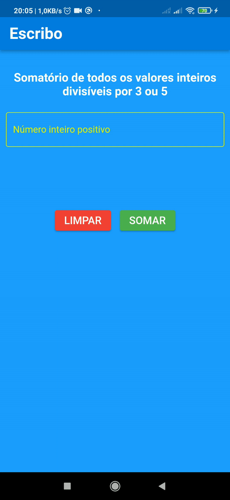

# app_escribo

Este repositório é referente a um desafio para a vaga de Backend Iniciante - Escribo Inovação para o Aprendizado.

Para usar o código de solução do desafio siga os seguintes passos.

## Passo 1
Clone o repositório com o seguinte comando:

~~~
git clone https://github.com/NascimentoFrancisco/app-escribo.git
~~~
## Passo 2

Entre no diretório do projeto e o abra com o seu editor de preferência e atualize os pacotes do projeto:

~~~
flutter pub get
~~~

## Passo 3 

Agora é só debugar o projeto em um emulador android ou outro dispositivo.

## Saída

